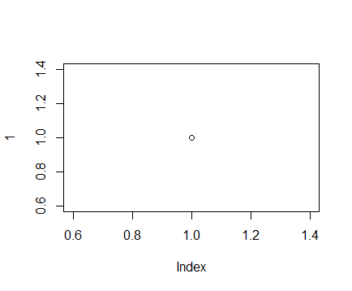

```{r pacotes, include=FALSE}
if (!require("vegan")) install.packages("vegan")
if (!require("knitr")) install.packages("knitr")
```


# Resumo

# Introdução
~~Eu~~ amo *chocolate* com **café** (Mainha, 1991).
<!-- Quero fazer um comentário aqui. -->

H~2~O

m^2^

- Item 1
  - Item 1.1

- Item 2

- Item 3

1. Item

2. Item

# M&M



## Coleta de dados

## Análise de dados

```{r, echo=FALSE, eval=TRUE, results='asis'}
data("mtcars")

summary(lm(mpg ~ carb, mtcars))
```


# Resultados

A tabela *mtcars* tem `r ncol(mtcars)` colunas.
```{r, echo=FALSE, eval=FALSE}
nrow(mtcars)
ncol(mtcars)
```

Tabela 1. Modelos de carros antigos e suas características
```{r, echo=FALSE}
data("mtcars")
kable(mtcars)
```


A cerquinha abaixo não mostra o código nem o resultado dele

```{r cerquinha-do-plot, echo=FALSE, eval=FALSE}
plot(1)
```

A cerquinha abaixo mostra o código e não o resultado dele

```{r, echo=TRUE, eval=FALSE}
plot(1)
```

A cerquinha abaixo mostra o código e o resultado dele

```{r, echo=TRUE, eval=TRUE, fig.cap = "Fig.1 Meu plot"}
plot(1)
```


# Discussão

Estou citando fulaninho [@Carnicer2007]. Segundo [@Lopes2015] isso pode acontecer.

Estou citando várias pessoas que disseram que fizeram isso [see @Ramirez-Flores2015; @Lopes2015]

# Referências
